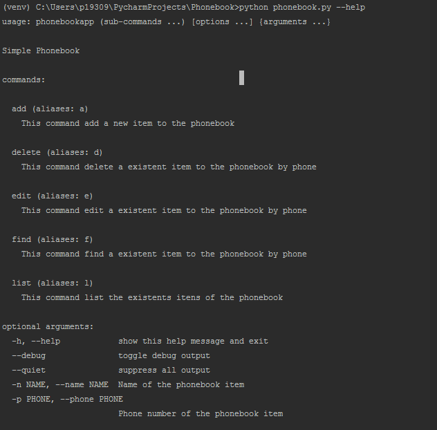
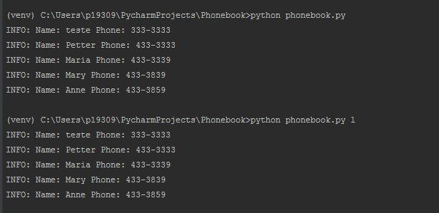
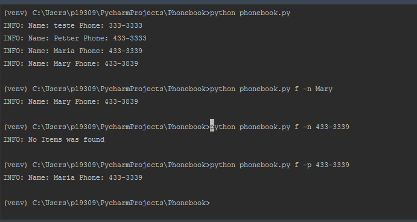
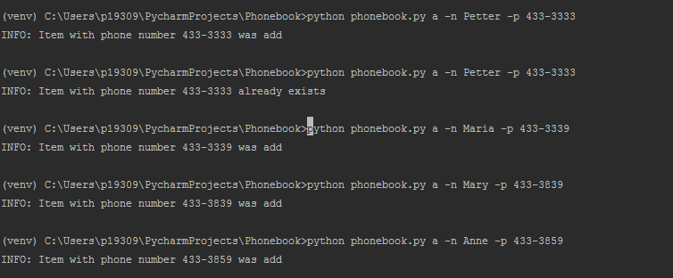
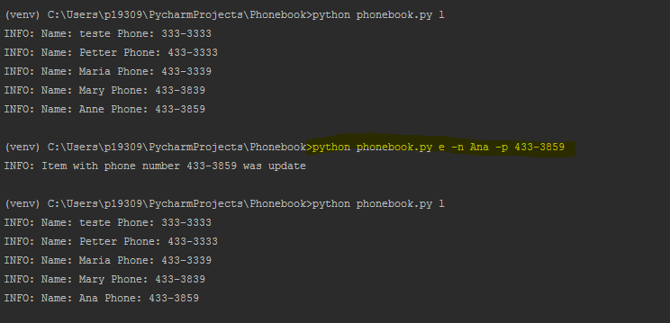
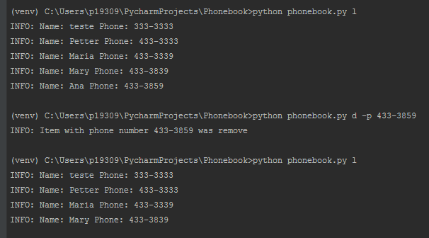

# Phonebook
Simple phonebook shell in python with persistent data

## Instructions

1. Install python
2. Clone this repository to your machine
3. Run 
```python
pip install -r requirements.txt
```
4. Run the follows commands to add,edit,list and delete items on the phonebook
5. The contacts are persisting on the phonebook.json file

### Help


### List


### Find


### Add


### Edit


### Delete


